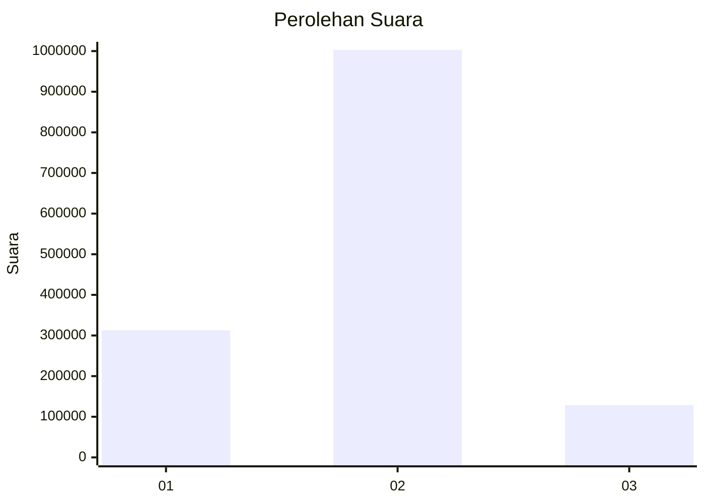

# Hasil

Wilayah **SULAWESI TENGAH**

## Grafik

## Tabel

| No. | Nama Paslon    | Suara     | Suara (raw) | Persentase |
|:--- |:-------------- | ---------:| -----------:| ----------:|
| 1   | ANIES MUHAIMIN | 312.806   | 312806      | 21,65      |
| 2   | PRABOWO GIBRAN | 1.003.096 | 1003096     | 69,43      |
| 3   | GANJAR MAHFUD  | 128.802   | 128802      | 8,92       |

## Metadata

| Key             | Value   |
| --------------- | ------- |
| Tipe Pemilu     | Reguler |
| Persentase      | 86,46   |
| Status Progress | On      |

