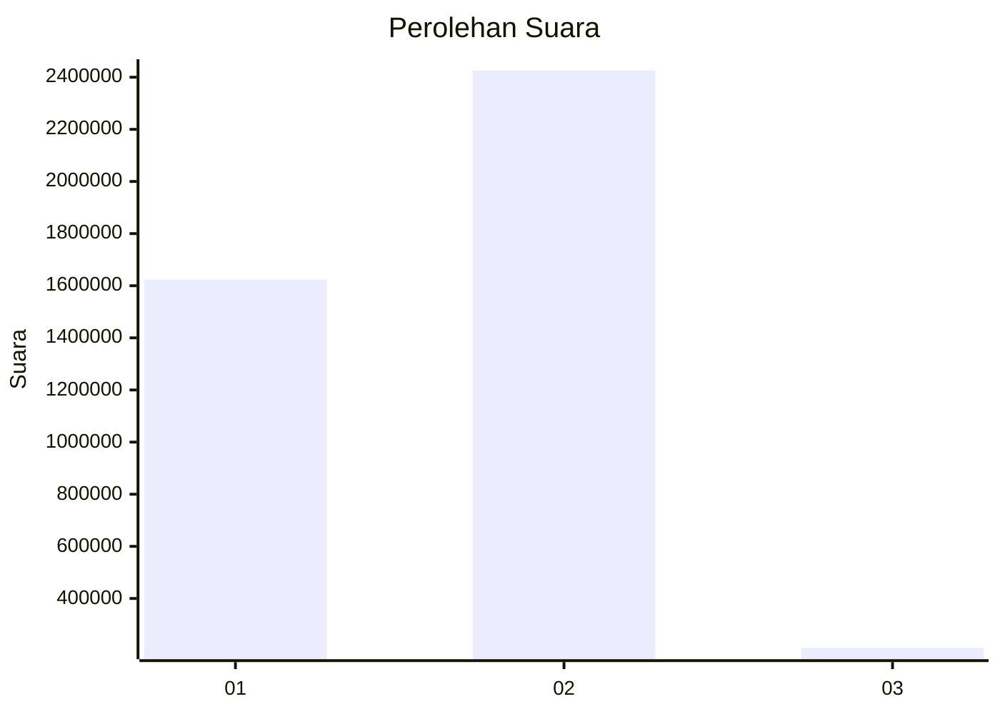

# Hasil

Wilayah **SULAWESI SELATAN**

## Grafik

## Tabel

| No. | Nama Paslon    | Suara     | Suara (raw) | Persentase |
|:--- |:-------------- | ---------:| -----------:| ----------:|
| 1   | ANIES MUHAIMIN | 1.623.338 | 1623338     | 38,12      |
| 2   | PRABOWO GIBRAN | 2.425.470 | 2425470     | 56,95      |
| 3   | GANJAR MAHFUD  | 210.196   | 210196      | 4,94       |

## Metadata

| Key             | Value   |
| --------------- | ------- |
| Tipe Pemilu     | Reguler |
| Persentase      | 79,24   |
| Status Progress | On      |

