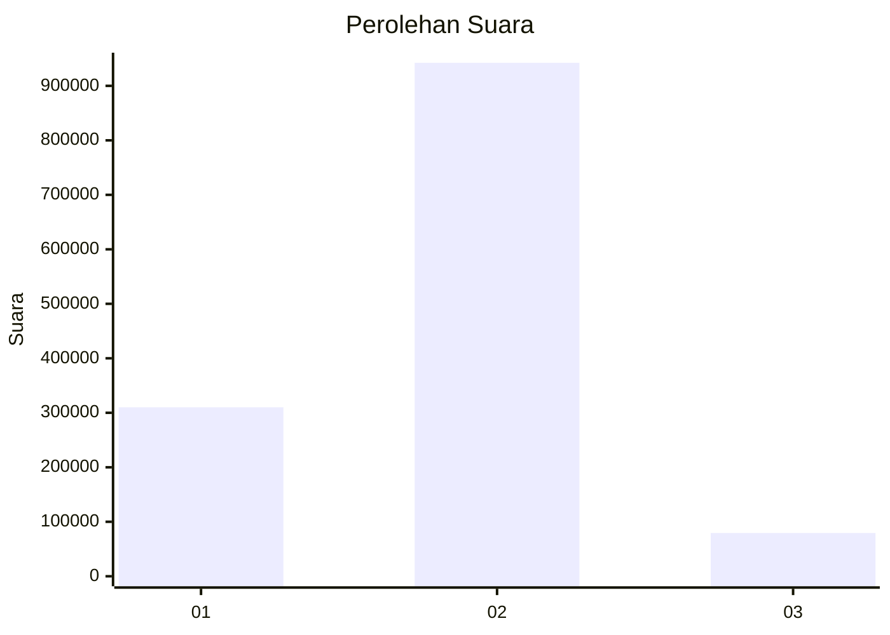
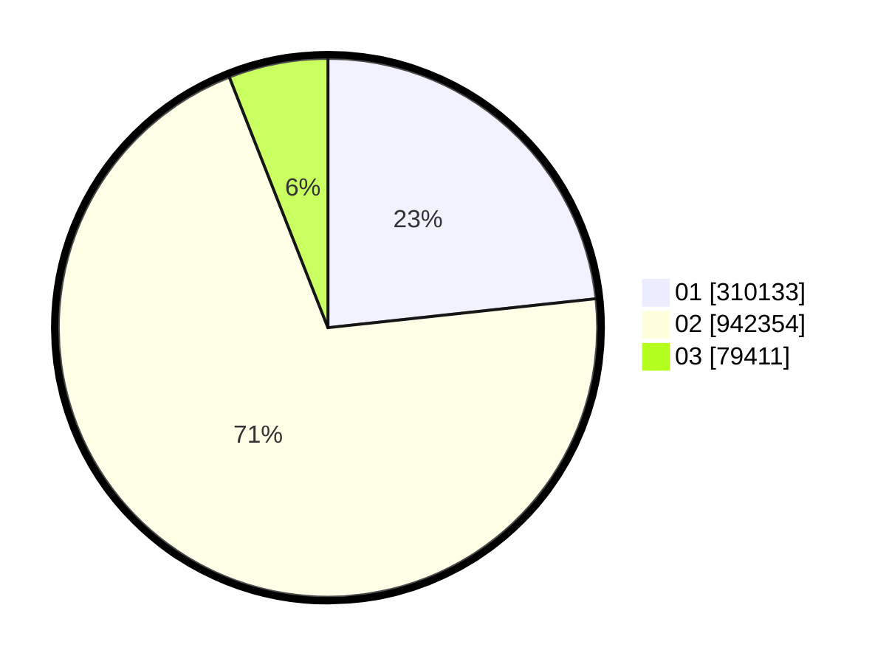

# Hasil

Wilayah **SULAWESI TENGGARA**

## Grafik

## Tabel

| No. | Nama Paslon    | Suara   | Suara (raw) | Persentase |
|:--- |:-------------- | -------:| -----------:| ----------:|
| 1   | ANIES MUHAIMIN | 310.133 | 310133      | 23,29      |
| 2   | PRABOWO GIBRAN | 942.354 | 942354      | 70,75      |
| 3   | GANJAR MAHFUD  | 79.411  | 79411       | 5,96       |

## Metadata

| Key             | Value   |
| --------------- | ------- |
| Tipe Pemilu     | Reguler |
| Persentase      | 85,75   |
| Status Progress | On      |

