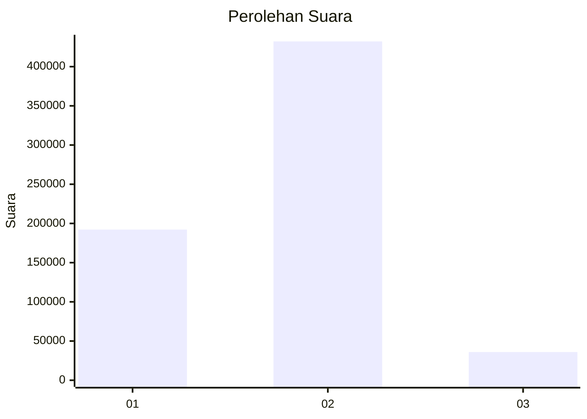
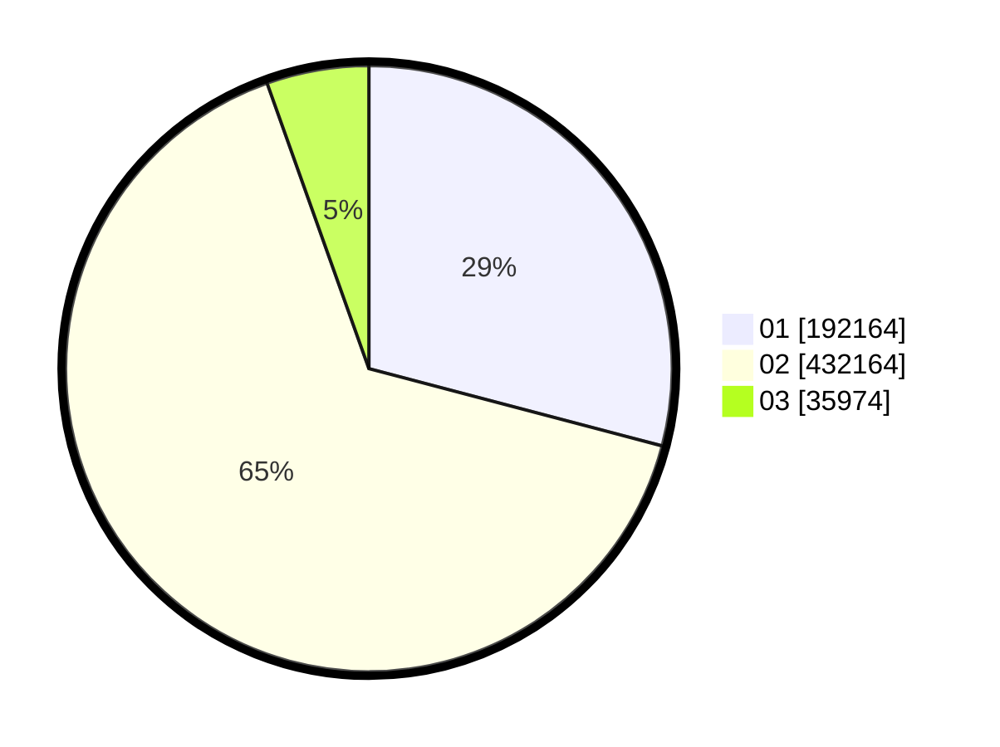

# Hasil

Wilayah **GORONTALO**

## Grafik

## Tabel

| No. | Nama Paslon    | Suara   | Suara (raw) | Persentase |
|:--- |:-------------- | -------:| -----------:| ----------:|
| 1   | ANIES MUHAIMIN | 192.164 | 192164      | 29,10      |
| 2   | PRABOWO GIBRAN | 432.164 | 432164      | 65,45      |
| 3   | GANJAR MAHFUD  | 35.974  | 35974       | 5,45       |

## Metadata

| Key             | Value   |
| --------------- | ------- |
| Tipe Pemilu     | Reguler |
| Persentase      | 97,23   |
| Status Progress | On      |

