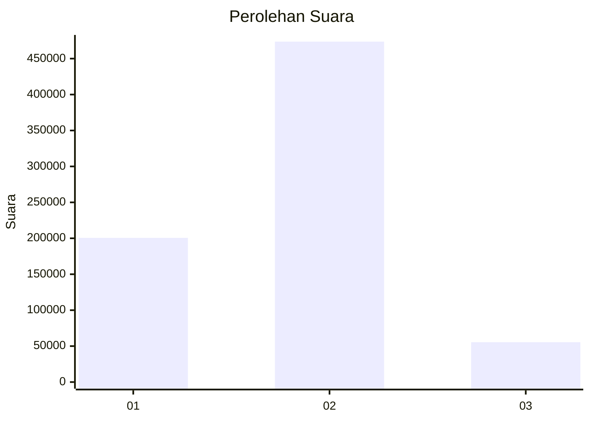

# Hasil

Wilayah **SULAWESI BARAT**

## Grafik

## Tabel

| No. | Nama Paslon    | Suara   | Suara (raw) | Persentase |
|:--- |:-------------- | -------:| -----------:| ----------:|
| 1   | ANIES MUHAIMIN | 200.637 | 200637      | 27,49      |
| 2   | PRABOWO GIBRAN | 473.637 | 473637      | 64,90      |
| 3   | GANJAR MAHFUD  | 55.466  | 55466       | 7,60       |

## Metadata

| Key             | Value   |
| --------------- | ------- |
| Tipe Pemilu     | Reguler |
| Persentase      | 96,18   |
| Status Progress | On      |

