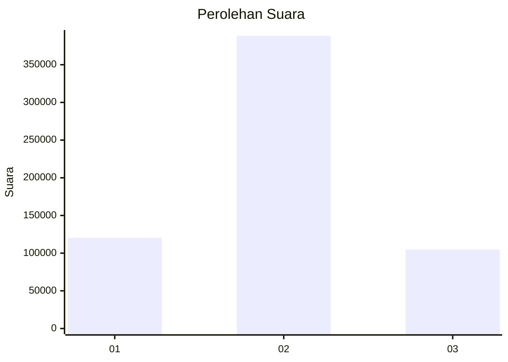
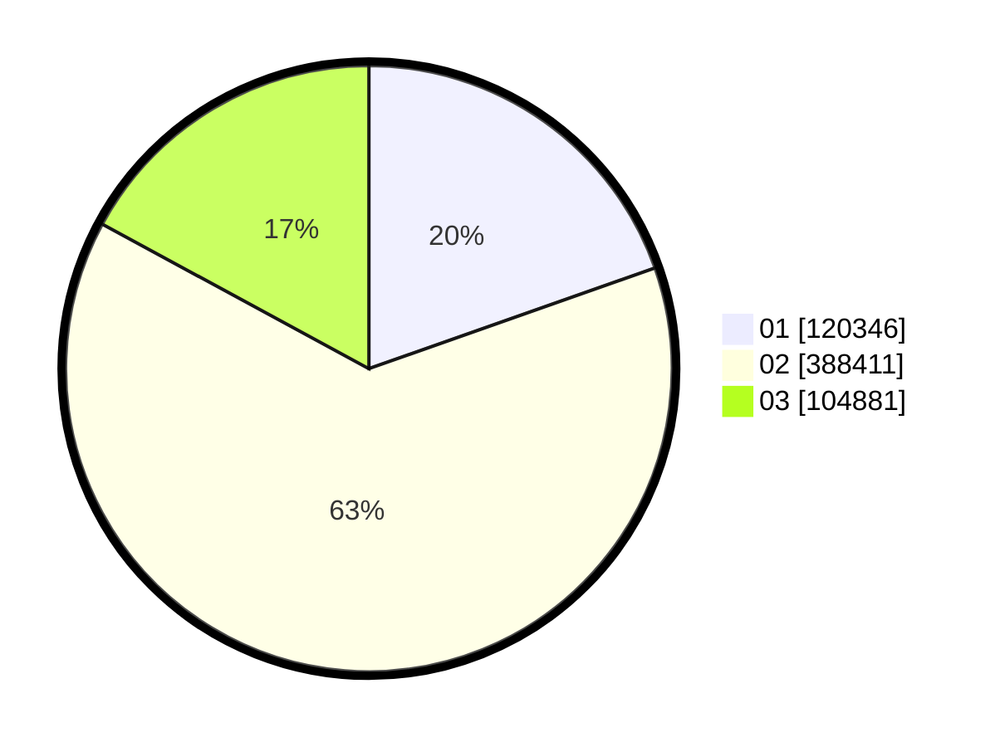

# Hasil

Wilayah **MALUKU**

## Grafik

## Tabel

| No. | Nama Paslon    | Suara   | Suara (raw) | Persentase |
|:--- |:-------------- | -------:| -----------:| ----------:|
| 1   | ANIES MUHAIMIN | 120.346 | 120346      | 19,61      |
| 2   | PRABOWO GIBRAN | 388.411 | 388411      | 63,30      |
| 3   | GANJAR MAHFUD  | 104.881 | 104881      | 17,09      |

## Metadata

| Key             | Value   |
| --------------- | ------- |
| Tipe Pemilu     | Reguler |
| Persentase      | 57,51   |
| Status Progress | On      |

