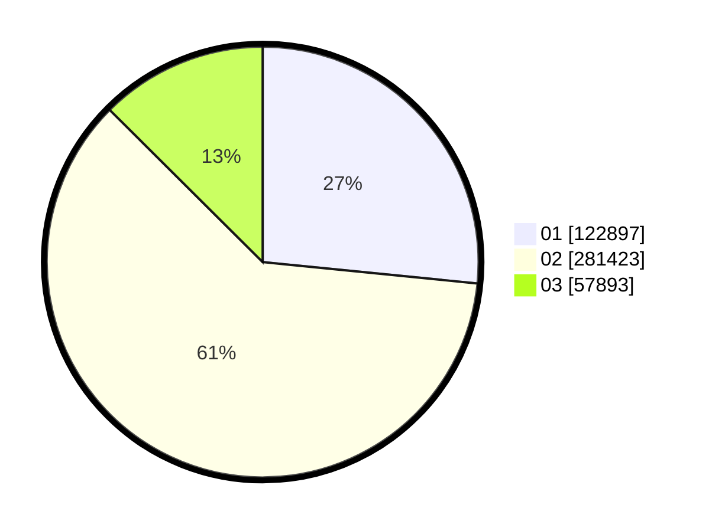

# Hasil

Wilayah **MALUKU UTARA**

## Grafik

## Tabel

| No. | Nama Paslon    | Suara   | Suara (raw) | Persentase |
|:--- |:-------------- | -------:| -----------:| ----------:|
| 1   | ANIES MUHAIMIN | 122.897 | 122897      | 26,59      |
| 2   | PRABOWO GIBRAN | 281.423 | 281423      | 60,89      |
| 3   | GANJAR MAHFUD  | 57.893  | 57893       | 12,53      |

## Metadata

| Key             | Value   |
| --------------- | ------- |
| Tipe Pemilu     | Reguler |
| Persentase      | 58,71   |
| Status Progress | On      |

