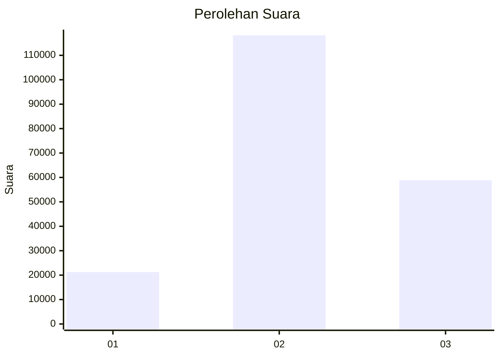
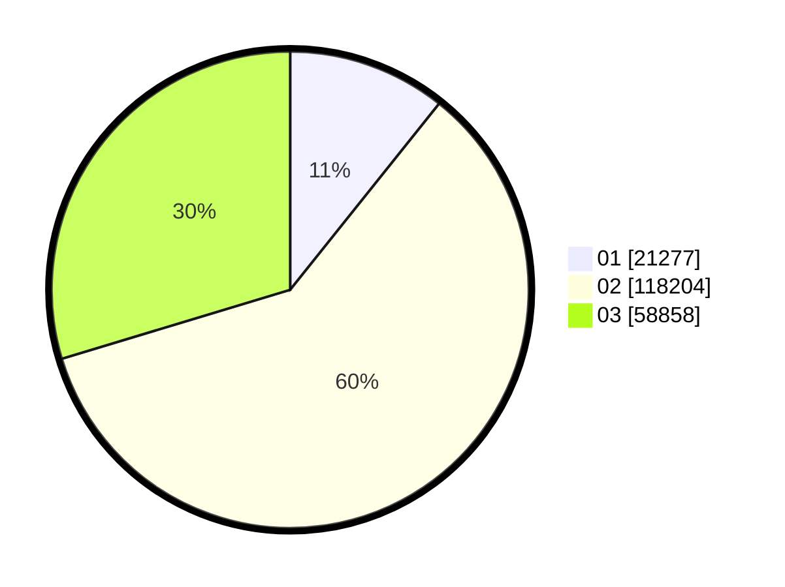

# Hasil

Wilayah **PAPUA**

## Grafik

## Tabel

| No. | Nama Paslon    | Suara   | Suara (raw) | Persentase |
|:--- |:-------------- | -------:| -----------:| ----------:|
| 1   | ANIES MUHAIMIN | 21.277  | 21277       | 10,73      |
| 2   | PRABOWO GIBRAN | 118.204 | 118204      | 59,60      |
| 3   | GANJAR MAHFUD  | 58.858  | 58858       | 29,68      |

## Metadata

| Key             | Value   |
| --------------- | ------- |
| Tipe Pemilu     | Reguler |
| Persentase      | 32,81   |
| Status Progress | On      |

