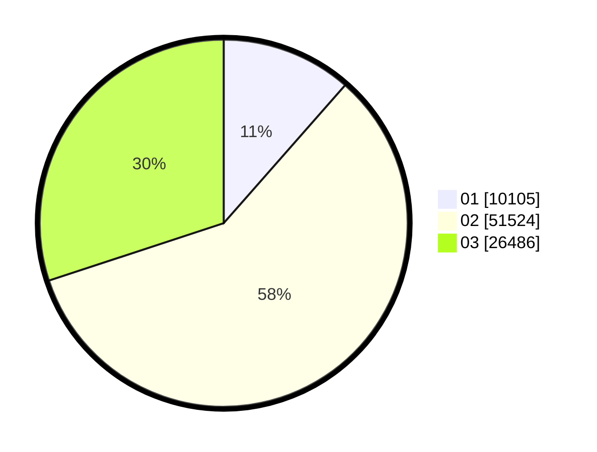

# Hasil

Wilayah **PAPUA BARAT**

## Grafik

## Tabel

| No. | Nama Paslon    | Suara  | Suara (raw) | Persentase |
|:--- |:-------------- | ------:| -----------:| ----------:|
| 1   | ANIES MUHAIMIN | 10.105 | 10105       | 11,47      |
| 2   | PRABOWO GIBRAN | 51.524 | 51524       | 58,47      |
| 3   | GANJAR MAHFUD  | 26.486 | 26486       | 30,06      |

## Metadata

| Key             | Value   |
| --------------- | ------- |
| Tipe Pemilu     | Reguler |
| Persentase      | 34,53   |
| Status Progress | On      |

