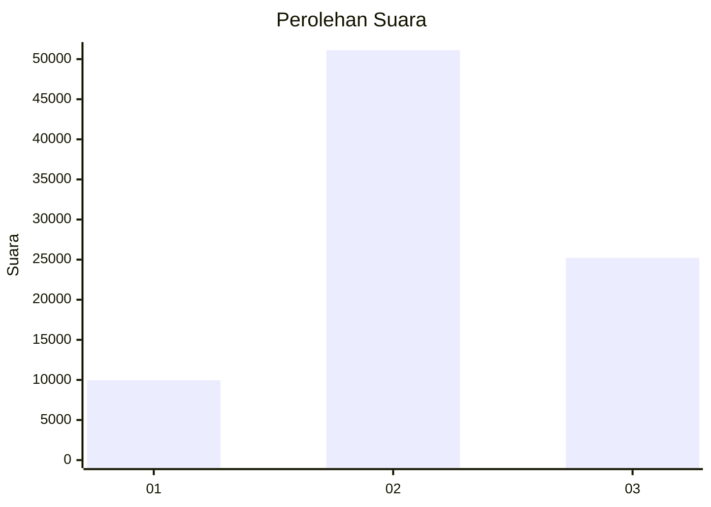

# Hasil

Wilayah **PAPUA BARAT**

## Grafik

## Tabel

| No. | Nama Paslon    | Suara  | Suara (raw) | Persentase |
|:--- |:-------------- | ------:| -----------:| ----------:|
| 1   | ANIES MUHAIMIN | 9.962  | 9962        | 11,54      |
| 2   | PRABOWO GIBRAN | 51.124 | 51124       | 59,24      |
| 3   | GANJAR MAHFUD  | 25.210 | 25210       | 29,21      |

## Metadata

| Key             | Value   |
| --------------- | ------- |
| Tipe Pemilu     | Reguler |
| Persentase      | 32,14   |
| Status Progress | On      |

