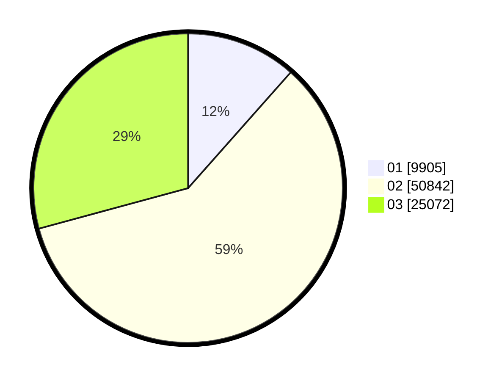

# Hasil

Wilayah **PAPUA BARAT**

## Grafik

## Tabel

| No. | Nama Paslon    | Suara  | Suara (raw) | Persentase |
|:--- |:-------------- | ------:| -----------:| ----------:|
| 1   | ANIES MUHAIMIN | 9.905  | 9905        | 11,54      |
| 2   | PRABOWO GIBRAN | 50.842 | 50842       | 59,24      |
| 3   | GANJAR MAHFUD  | 25.072 | 25072       | 29,21      |

## Metadata

| Key             | Value   |
| --------------- | ------- |
| Tipe Pemilu     | Reguler |
| Persentase      | 27,30   |
| Status Progress | On      |

