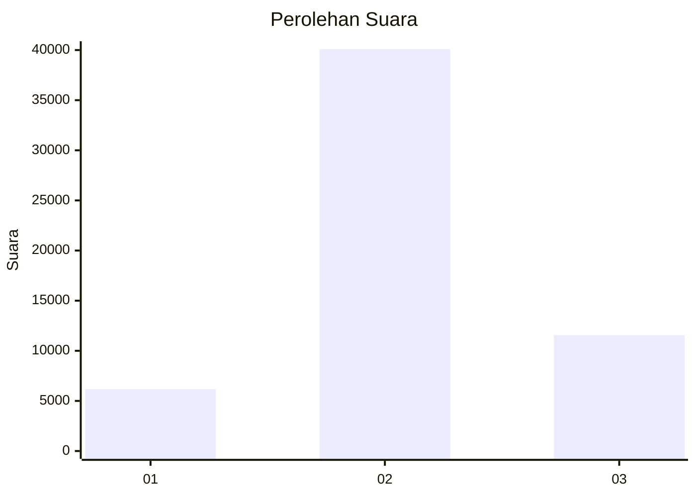
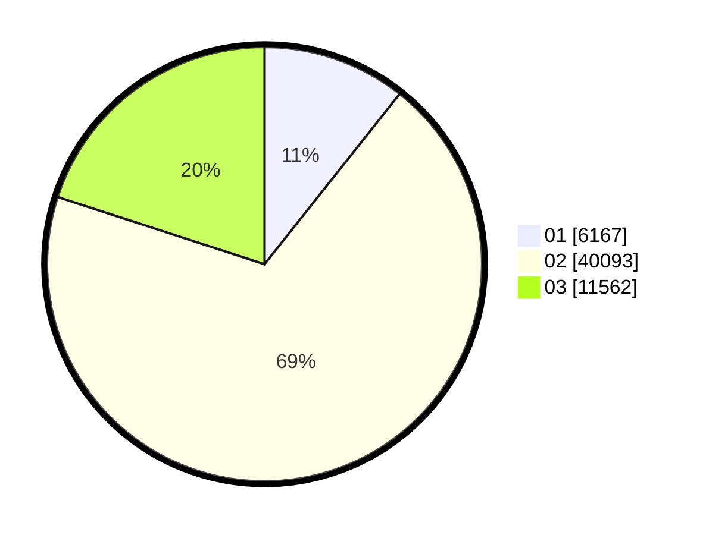

# Hasil

Wilayah **PAPUA SELATAN**

## Grafik

## Tabel

| No. | Nama Paslon    | Suara  | Suara (raw) | Persentase |
|:--- |:-------------- | ------:| -----------:| ----------:|
| 1   | ANIES MUHAIMIN | 6.167  | 6167        | 10,67      |
| 2   | PRABOWO GIBRAN | 40.093 | 40093       | 69,34      |
| 3   | GANJAR MAHFUD  | 11.562 | 11562       | 20,00      |

## Metadata

| Key             | Value   |
| --------------- | ------- |
| Tipe Pemilu     | Reguler |
| Persentase      | 18,08   |
| Status Progress | On      |

