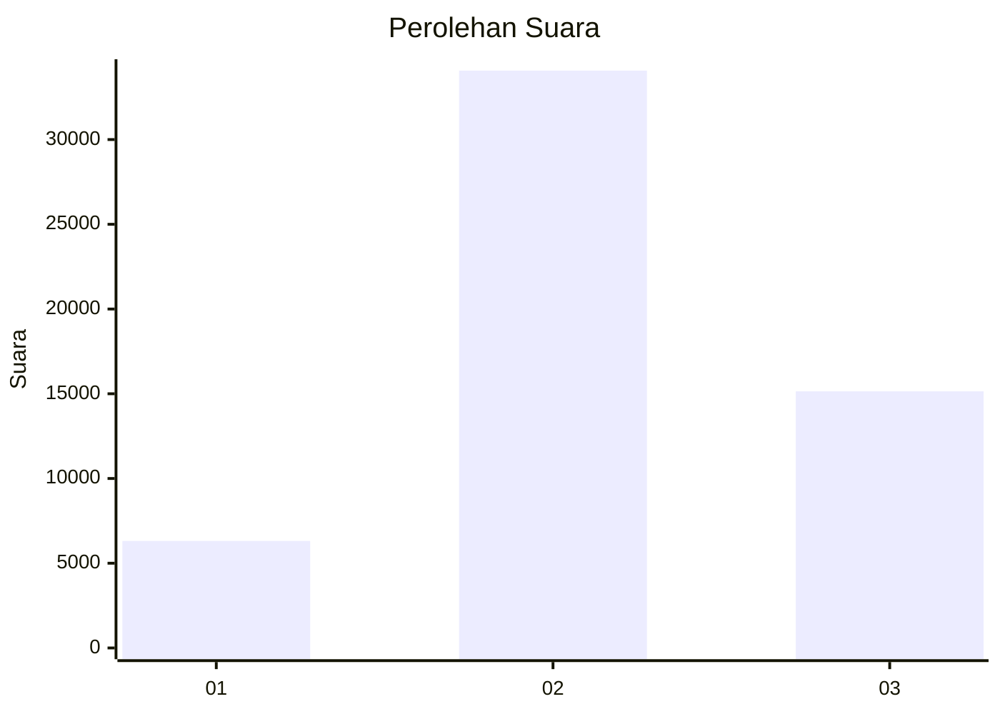
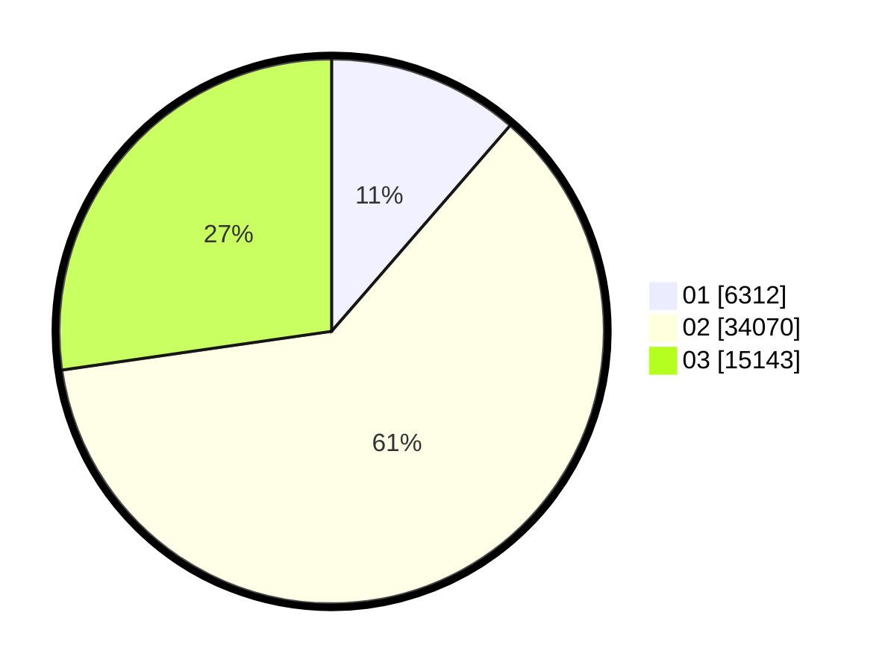

# Hasil

Wilayah **PAPUA TENGAH**

## Grafik

## Tabel

| No. | Nama Paslon    | Suara  | Suara (raw) | Persentase |
|:--- |:-------------- | ------:| -----------:| ----------:|
| 1   | ANIES MUHAIMIN | 6.312  | 6312        | 11,37      |
| 2   | PRABOWO GIBRAN | 34.070 | 34070       | 61,36      |
| 3   | GANJAR MAHFUD  | 15.143 | 15143       | 27,27      |

## Metadata

| Key             | Value   |
| --------------- | ------- |
| Tipe Pemilu     | Reguler |
| Persentase      | 4,66    |
| Status Progress | On      |

