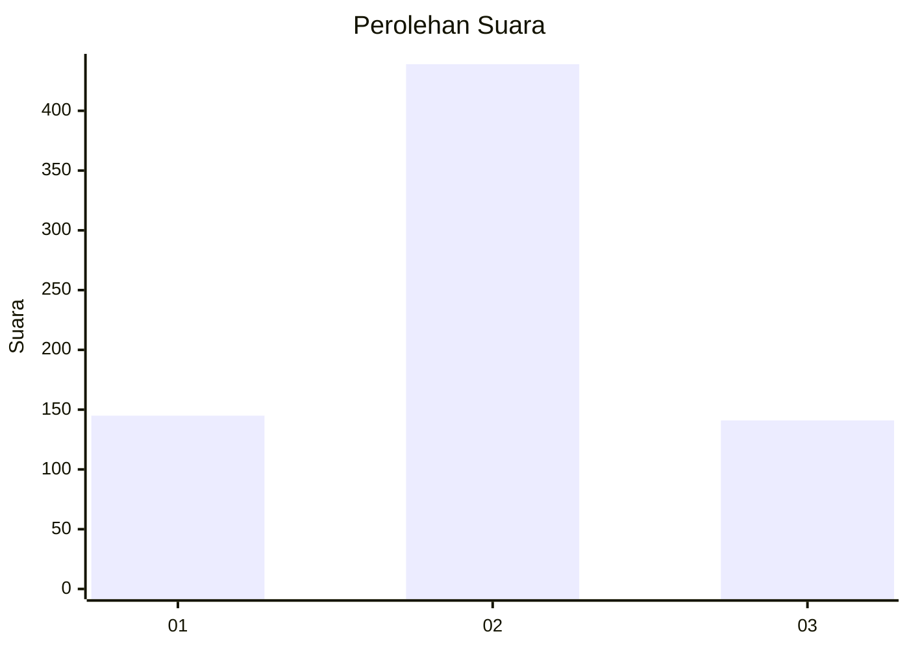
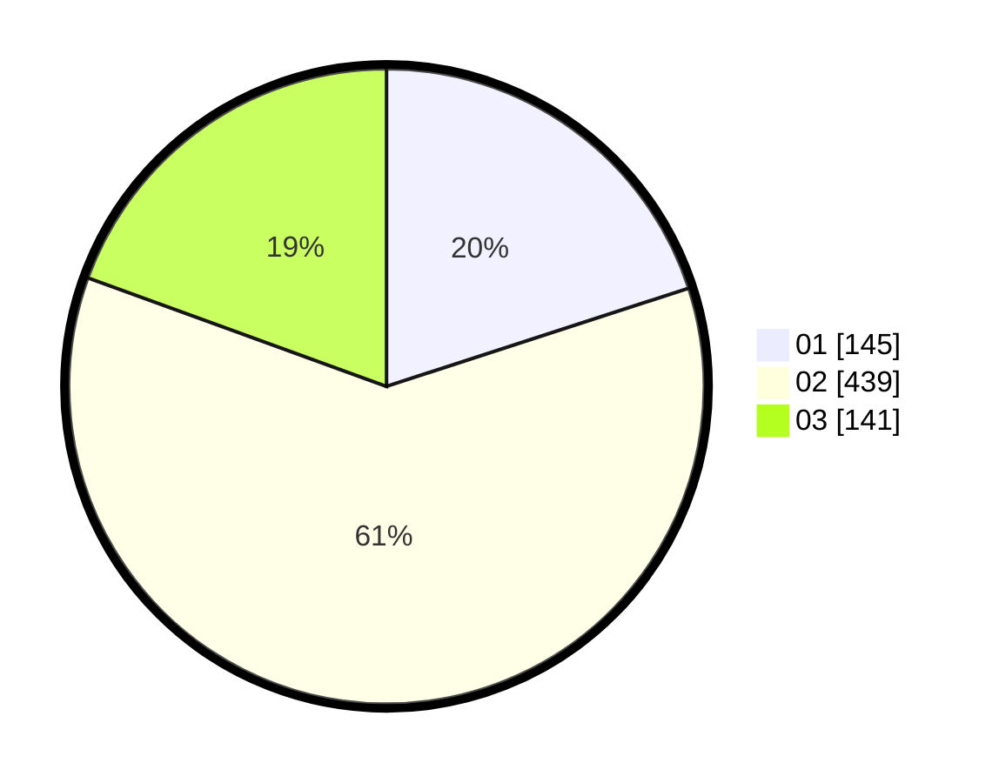

# Hasil

Wilayah **PAPUA PEGUNUNGAN**

## Grafik

## Tabel

| No. | Nama Paslon    | Suara | Suara (raw) | Persentase |
|:--- |:-------------- | -----:| -----------:| ----------:|
| 1   | ANIES MUHAIMIN | 145   | 145         | 20,00      |
| 2   | PRABOWO GIBRAN | 439   | 439         | 60,55      |
| 3   | GANJAR MAHFUD  | 141   | 141         | 19,45      |

## Metadata

| Key             | Value   |
| --------------- | ------- |
| Tipe Pemilu     | Reguler |
| Persentase      | 0,07    |
| Status Progress | On      |

