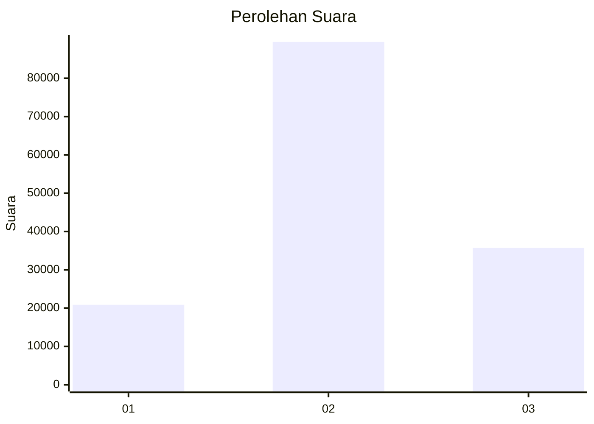
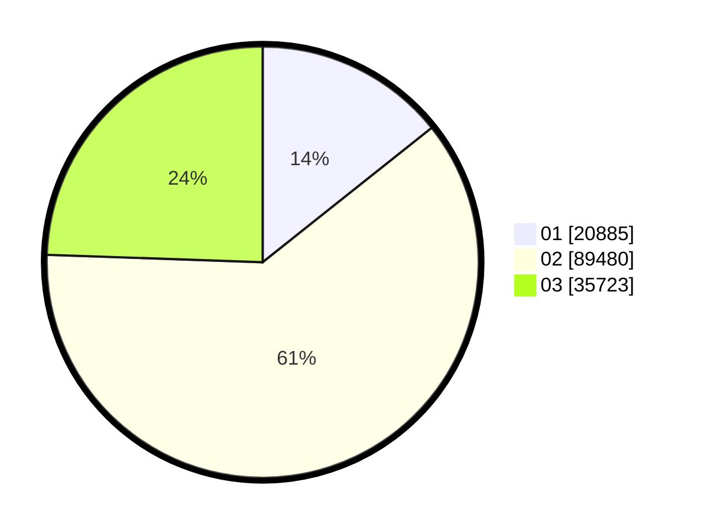

# Hasil

Wilayah **PAPUA BARAT DAYA**

## Grafik

## Tabel

| No. | Nama Paslon    | Suara  | Suara (raw) | Persentase |
|:--- |:-------------- | ------:| -----------:| ----------:|
| 1   | ANIES MUHAIMIN | 20.885 | 20885       | 14,30      |
| 2   | PRABOWO GIBRAN | 89.480 | 89480       | 61,25      |
| 3   | GANJAR MAHFUD  | 35.723 | 35723       | 24,45      |

## Metadata

| Key             | Value   |
| --------------- | ------- |
| Tipe Pemilu     | Reguler |
| Persentase      | 39,84   |
| Status Progress | On      |

