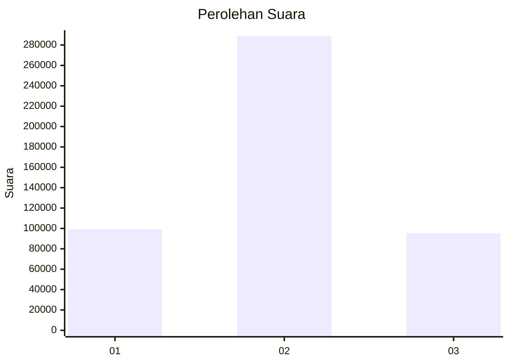

# Hasil

Wilayah **Luar Negeri**

## Grafik

## Tabel

| No. | Nama Paslon    | Suara   | Suara (raw) | Persentase |
|:--- |:-------------- | -------:| -----------:| ----------:|
| 1   | ANIES MUHAIMIN | 99.105  | 99105       | 20,50      |
| 2   | PRABOWO GIBRAN | 288.872 | 288872      | 59,76      |
| 3   | GANJAR MAHFUD  | 95.382  | 95382       | 19,73      |

## Metadata

| Key             | Value   |
| --------------- | ------- |
| Tipe Pemilu     | Reguler |
| Persentase      | 56,48   |
| Status Progress | On      |

