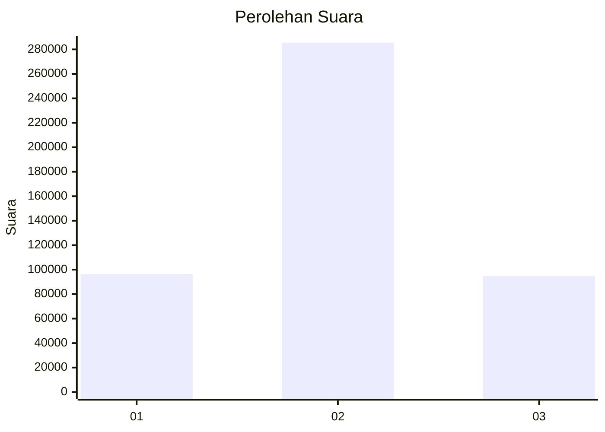

# Hasil

Wilayah **Luar Negeri**

## Grafik

## Tabel

| No. | Nama Paslon    | Suara   | Suara (raw) | Persentase |
|:--- |:-------------- | -------:| -----------:| ----------:|
| 1   | ANIES MUHAIMIN | 96.458  | 96458       | 20,24      |
| 2   | PRABOWO GIBRAN | 285.456 | 285456      | 59,89      |
| 3   | GANJAR MAHFUD  | 94.712  | 94712       | 19,87      |

## Metadata

| Key             | Value   |
| --------------- | ------- |
| Tipe Pemilu     | Reguler |
| Persentase      | 54,09   |
| Status Progress | On      |

