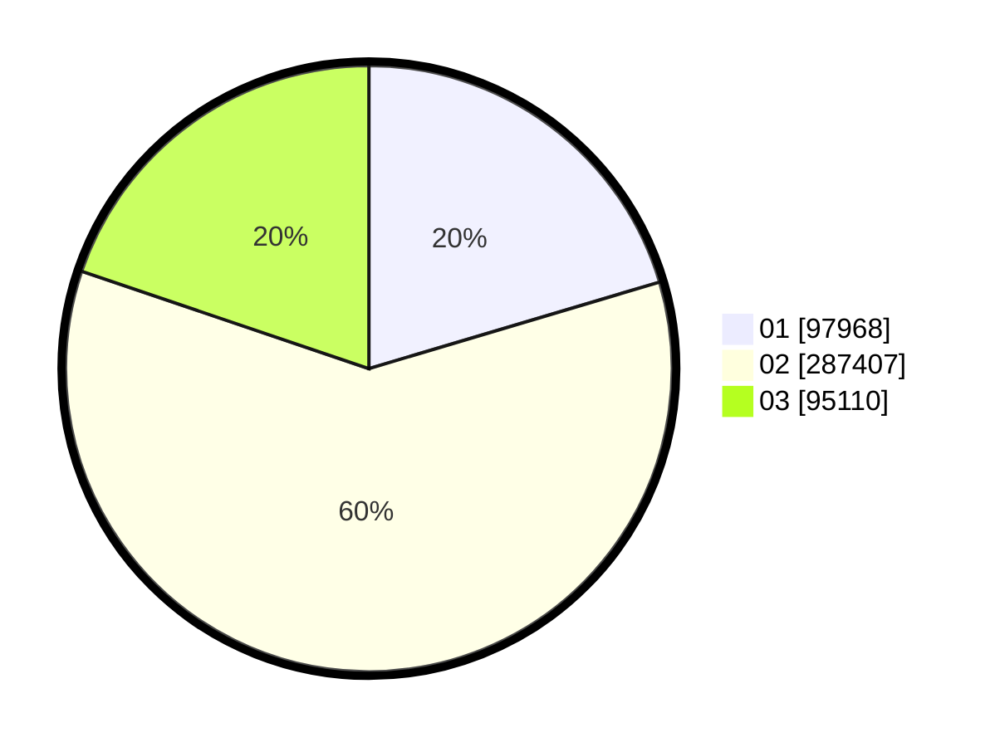

# Hasil

Wilayah **Luar Negeri**

## Grafik

## Tabel

| No. | Nama Paslon    | Suara   | Suara (raw) | Persentase |
|:--- |:-------------- | -------:| -----------:| ----------:|
| 1   | ANIES MUHAIMIN | 97.968  | 97968       | 20,39      |
| 2   | PRABOWO GIBRAN | 287.407 | 287407      | 59,82      |
| 3   | GANJAR MAHFUD  | 95.110  | 95110       | 19,79      |

## Metadata

| Key             | Value   |
| --------------- | ------- |
| Tipe Pemilu     | Reguler |
| Persentase      | 55,05   |
| Status Progress | On      |

